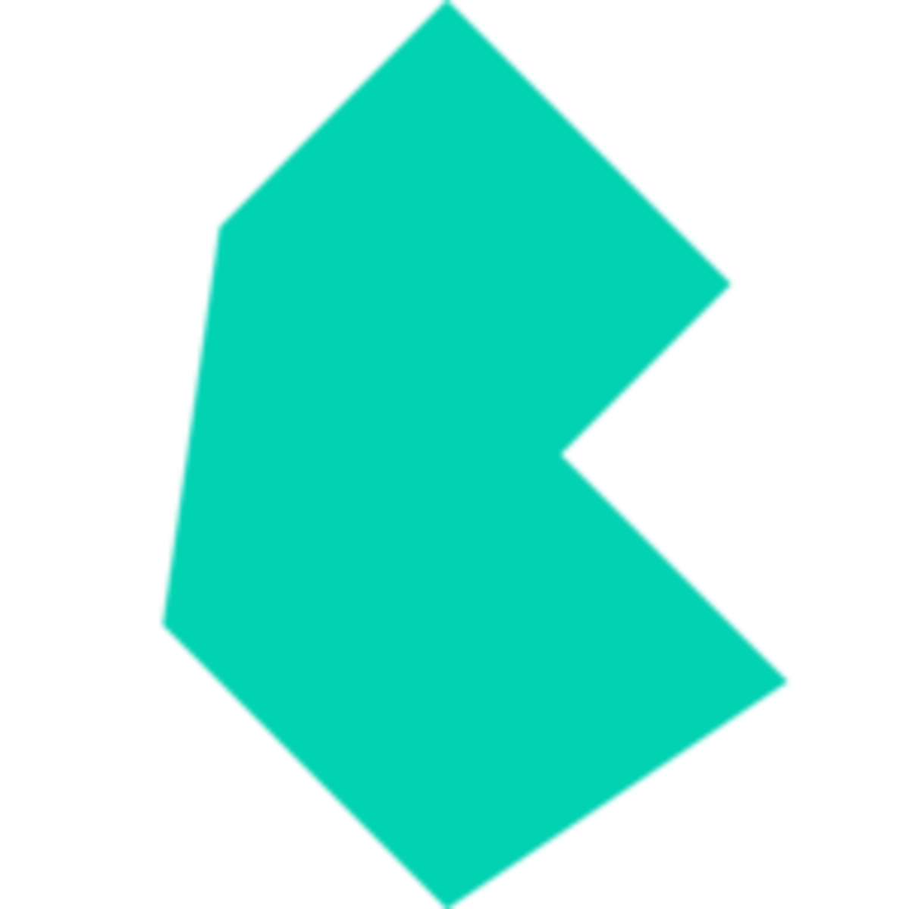

<h1 align="center">Hi there 👋, I'm Matheus Monteiro!</h1>
<h3 align="center">Junior Frontend Developer from Brazil 🇧🇷</h3>

<h3 align="center">Languages and Tools:</h3>

   
  
        
     

&nbsp;

<h3 align="center">Find me on LinkedIn:</h3>

  

